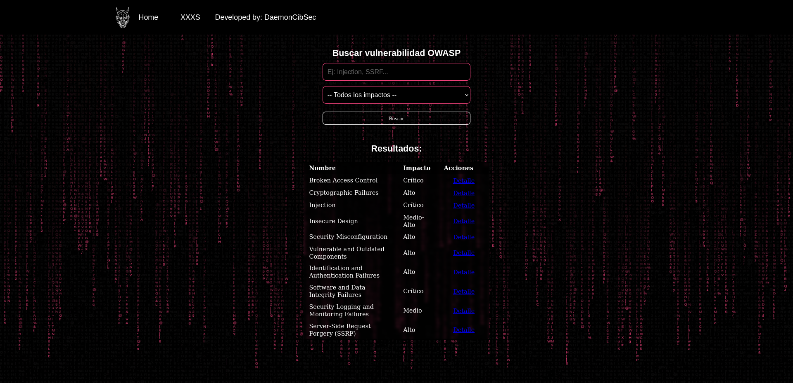

# Flask_Project

## Overview

This flask project is made not to show any kind of information, neither to share knowledge. It's just a test so my professors can determine (as always) if I gathered the enough skill using this library and a few of the functionalities it contains. However, I made the website inspired on the OWASP top 10 vulnerabilities, so even though it's a bit clunky deploy a wb server to show these most common web vulnerabilities, you definately could (though the description is really short because I didn't want to spend time writing mere text instead of coding).

## Setting up the script

```bash
pip install -r requirements.txt
```

In case of error, you can force the installation using this command:

```bash
pip install -r requirements.txt --break-system-packages
```

Though it is not recommended because it could cause many problems in your system due to broken packages.

## Starting the script / Ejecutar el script

```bash
python3 project.py
```

## Preview / Demostración


